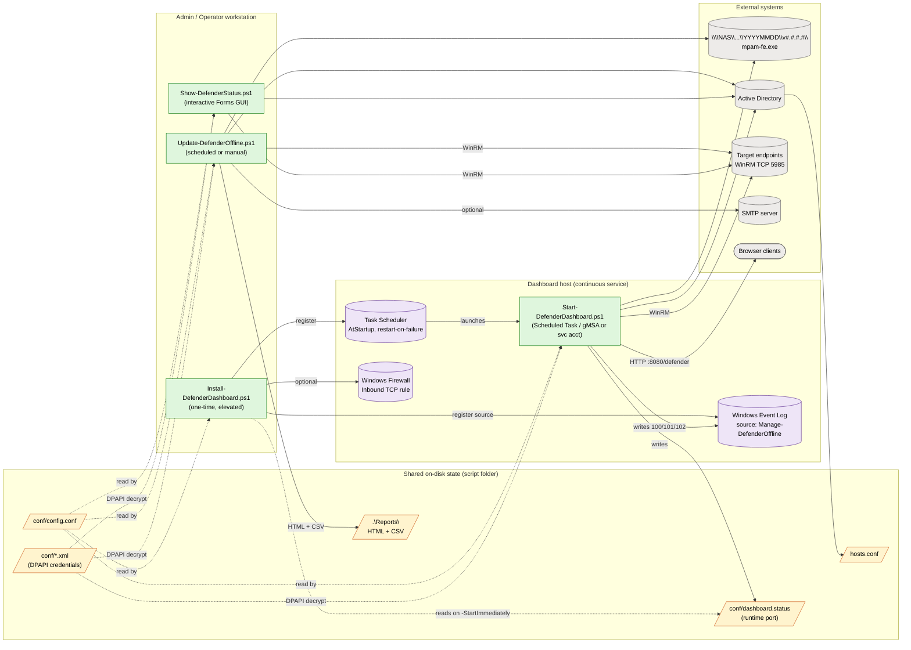
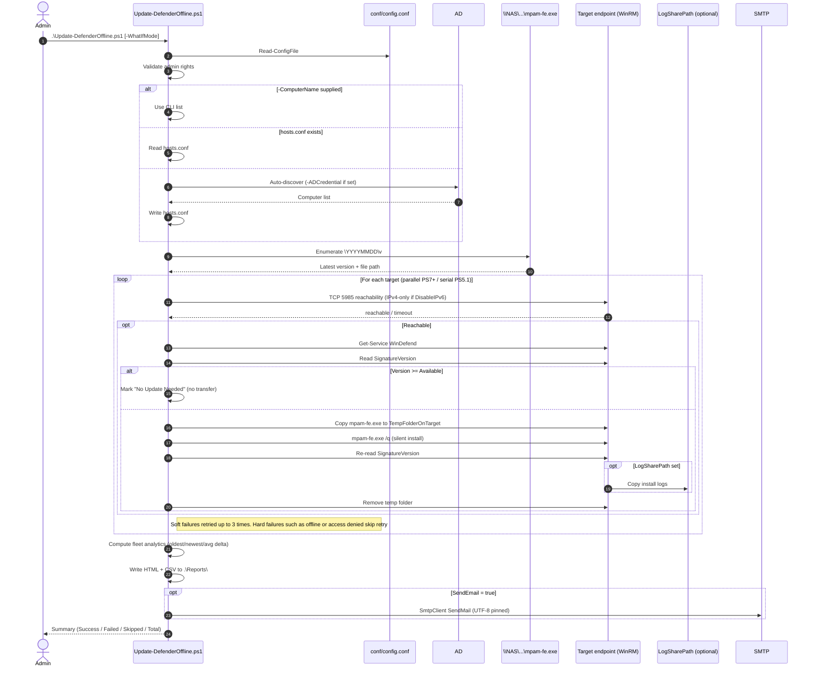
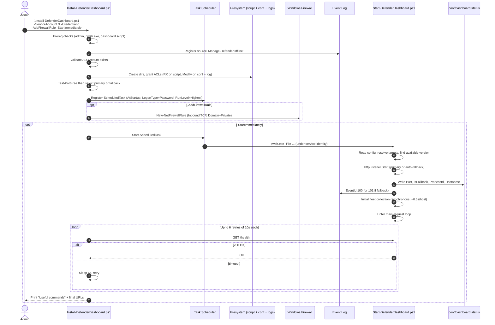
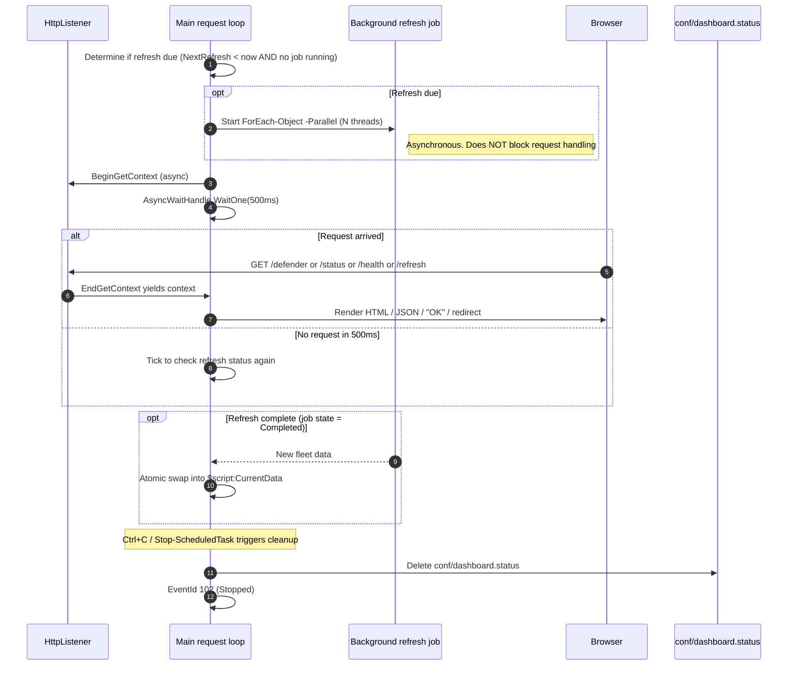
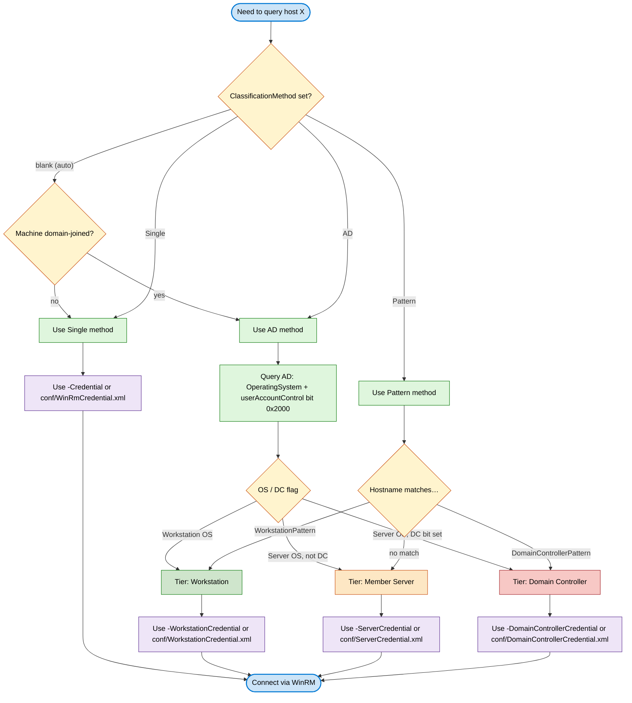

# Manage-DefenderOffline — Architecture

This document describes how the four scripts, shared configuration, runtime state, and external systems fit together. It complements [README.md](README.md), which is the user-facing quick reference for installing and operating the toolkit.

Read this when you need to understand **why** something is the way it is, or how a change to one component will ripple through the rest of the system.

---

## 1. System Overview



**Legend:** 🟢 green = toolkit scripts · 🟣 purple = Windows infrastructure · 🟡 amber = shared on-disk state · ⚪ gray = external systems

**Component responsibilities:**

| Component | Owns | Reads but doesn't own |
|---|---|---|
| `Update-DefenderOffline.ps1` | Per-host install logs, HTML/CSV reports, email | config, hosts.conf, credentials, share, AD |
| `Show-DefenderStatus.ps1` | Forms GUI, ad-hoc CSV/HTML export | config, hosts.conf, credentials, AD |
| `Start-DefenderDashboard.ps1` | `conf/dashboard.status`, dashboard log, event log writes | config, hosts.conf, credentials, AD |
| `Install-DefenderDashboard.ps1` | Scheduled task, event log source registration, ACLs, firewall rule | config, dashboard.status (read after start) |

---

## 2. Update Lifecycle (`Update-DefenderOffline.ps1`)



**Skip-without-transfer is the central optimisation.** A host whose installed `SignatureVersion` already matches or exceeds the latest available version is marked `No Update Needed` *before* the ~200 MB file copy. This is what makes the script tolerable on large fleets where the majority of hosts are already current.

---

## 3. Dashboard Service Lifecycle

### 3a. Install → first start



### 3b. Steady-state request loop



**Why `BeginGetContext` + `WaitOne(500)`:** the previous attempt used `HttpListener.Pending()` (which doesn't exist) and the obvious `GetContext()` (which blocks forever). The async pattern with a 500 ms wait keeps the loop responsive enough to check the background refresh job's state and to handle `Ctrl+C` cleanly, without busy-looping.

**Why the initial collection is synchronous before the request loop:** the first `/defender` GET would otherwise return an empty grid. Cost: the listener accepts TCP connections during init but won't respond to HTTP until the loop starts, which is why the installer's `/health` probe retries.

---

## 4. Credential & Classification Model

The Update and Show scripts can use **per-tier credentials** so that a workstation-admin account isn't sent to a domain controller (and vice versa). The dashboard service uses a single WinRM credential for simplicity.



**Legend:** 🟦 blue = start/end · 🟡 yellow = decision · 🟢 green = method/workstation · 🟠 orange = member server · 🔴 red = domain controller · 🟣 purple = credential file

**`-ADCredential` is separate.** It controls *how the script binds to AD for hosts.conf discovery*, not which credential is sent to the target endpoint. It exists for STIG-hardened environments where the running account has WinRM rights on endpoints but no AD read rights. Saved to `conf/ADCredential.xml` via DPAPI.

---

## 5. Runtime State & Event Log Contract

### On-disk runtime state

| File | Owner | Lifecycle | Purpose |
|---|---|---|---|
| `conf/config.conf` | Operator (committed to git) | Persistent | All script defaults |
| `hosts.conf` | First script run (gitignored) | Persistent, editable | Target computer list |
| `conf/WinRmCredential.xml` | `-SaveCredential` (DPAPI) | Persistent | Single WinRM credential |
| `conf/WorkstationCredential.xml` | `-SaveCredential` (DPAPI) | Persistent | Workstation-tier credential |
| `conf/ServerCredential.xml` | `-SaveCredential` (DPAPI) | Persistent | Member-server-tier credential |
| `conf/DomainControllerCredential.xml` | `-SaveCredential` (DPAPI) | Persistent | DC-tier credential |
| `conf/ADCredential.xml` | `-SaveADCredential` (DPAPI) | Persistent | AD-bind credential |
| `conf/SmtpCredential.xml` | `-SaveSmtpCredential` (DPAPI) | Persistent | SMTP credential |
| `conf/dashboard.status` | Dashboard process | **Created on start, deleted on clean stop** | Runtime port + PID; installer reads on `-StartImmediately`, ops scripts read to discover actual port |
| `C:\Logs\Update-DefenderOffline_*.log` | Update script | One per run | Update execution log |
| `C:\Logs\PerHost\<HOST>.log` | Update script (parallel mode) | One per host per run | Per-host install log |
| `C:\Logs\DefenderDashboard\DefenderDashboard_YYYYMMDD.log` | Dashboard service | Rolling daily | Dashboard service log |
| `.\Reports\DefenderUpdateReport_*.html` / `.csv` | Update script | One per run | Operator-facing reports |

**DPAPI credentials are scoped to the *user who saved them, on the machine where they were saved*.** A scheduled task running under `DOMAIN\svc-defender` cannot read a credential file saved by `DOMAIN\kismet`. That's why the installer has `-SaveCredential` (delegated to `Start-DefenderDashboard.ps1`) — it has to run as the service identity.

### Windows Event Log contract

Source: `Manage-DefenderOffline` · Log: `Application`

| EventId | Severity | When | Used by |
|---|---|---|---|
| **100** | Information | Dashboard started on the primary port | Ops monitoring (success heartbeat) |
| **101** | **Warning** | Dashboard started on a fallback port (primary was in use) | Ops monitoring (alert: investigate primary port collision) |
| **102** | Information | Dashboard stopped cleanly | Ops monitoring (uptime tracking) |

The source is registered once by `Install-DefenderDashboard.ps1`. Dashboard runs gracefully degrade if the source is missing — they log to the file log and continue. This is intentional so the dashboard can be run interactively from a non-elevated session for testing without forcing event log registration.

### Dashboard ↔ installer handshake

The `conf/dashboard.status` file is the **only** machine-readable contract between the installer's `-StartImmediately` probe and the running dashboard service. It uses the same key-value format as `config.conf` so `Read-ConfigFile` can parse both. Fields:

```ini
Port        = 8080      ; actually-bound port (may differ from configured Port)
PrimaryPort = 8080      ; the configured primary
IsFallback  = False     ; True if primary was in use and FallbackPort/sequential was selected
StartTime   = 2026-05-24T12:29:53
ProcessId   = 12345
Hostname    = HOME-DH01
```

The installer waits up to 45 s for this file, then performs an HTTP `/health` probe (retried up to 6 × 10 s). The status file is deleted on `Stop-ScheduledTask` or `Ctrl+C` so its mere presence implies a live service.

---

## 6. Design Decisions Worth Knowing

| Decision | Why | Where it bites |
|---|---|---|
| Theme priority is `localStorage` > config > script default | A user's per-browser preference shouldn't be silently overridden every time an admin flips the server-side default | Operators expecting `DashboardTheme = Light` in config to force-override a browser that already has Dark cached |
| Initial fleet collection runs synchronously before the request loop | First `/defender` GET would otherwise show an empty grid | `/health` does not respond until init finishes — `-StartImmediately` must retry |
| `FallbackPort` ships as `8090` in config but CLI default is `8443` | 8443 collides with Tomcat / Splunk / many self-signed test setups; 8090 is much less crowded | Documentation has to call out both values |
| `Send-MailMessage` replaced by `SmtpClient` | Marked `[Obsolete]` in PS7; emits a warning on every run | UTF-8 encoding and attachment paths must be set explicitly (defaults are ASCII + .NET CurrentDirectory) |
| `DisableIPv6 = true` by default | On LANs that advertise AAAA records but don't actually route IPv6, every unreachable host eats the full ~21 s TCP timeout before IPv4 fallback | Set `false` on networks where IPv6 is fully routed |
| `TaskFolder` normalized with trailing `\` | `Get-ScheduledTask -TaskPath` uses CIM WQL exact matching and won't find `'\HOME'` without the trailing slash | Useful-commands output and `Get-ScheduledTask` calls all need the normalized form |
| Async `BeginGetContext` request loop | `HttpListener.Pending()` doesn't exist (TcpListener-only idiom); `GetContext()` blocks forever | Loop responsiveness controlled by `WaitOne(500)` |

---

## See also

- [README.md](README.md) — quick reference
- [docs/tests/test-plan-v0.0.6.md](docs/tests/test-plan-v0.0.6.md) — release test plan with all attempt history
